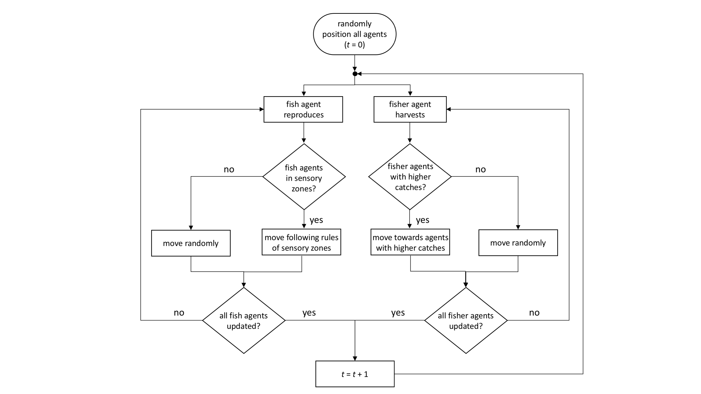

# Fishery Agent-Based Model (ABM) Project

This repository contains an Agent-Based Model (ABM) that simulates the dynamics of a small-scale, artisanal fishery. The model investigates the combined effects of fishing behavior (expressed through cooperation traits) and different designs of Marine Protected Areas (MPAs) on fish abundances and fishery yields.

## Overview

The model comprises two types of agents:
1. **Fishing agents (pirogues)** - Distinguished by different cooperation traits ranging from fully-cooperative to fully non-cooperative
2. **Fish agents** - Schooling fish with movement behavior based on repulsion, orientation, and attraction zones

The model allows for experimentation with:
- Different cooperation scenarios among fishers
- Various MPA configurations (presence/absence, size, age, and distance between MPAs)
- Sensitivity analysis of model parameters

## Project Structure

The project is organized as follows:

### Core Model Files
- `DynamicCoop.py`: Main model implementation with agent classes and simulation logic
- `parameters.py`: Central configuration of all model parameters
- `fish.py`: Fish population initialization and parameters
- `DynamicCoopUI.py`: Graphical user interface for parameter configuration and simulation execution
- `SimulationVisualizer.py`: Real-time visualization of fish and fisher movements

### Analysis Scripts
- `sens_anl.py`: Comprehensive sensitivity analysis (OFAT, Sobol, Morris methods)
- `morris_analysis_no_mpa.py`: Morris screening analysis for no-MPA scenario
- `morris_power_analysis.py`: Power analysis for Morris method sensitivity analysis
- `plot_morris_enhanced.py`: Enhanced visualization of Morris analysis results
- `plot_sobol_results.py`: Visualization of Sobol sensitivity analysis results
- `parameter_equilibrium_analyzer.py`: Analyzes parameter impacts on equilibrium states
- `five_param_sens.py`: Focused analysis on five key parameters
- `focused_sens_anl.py`: Targeted sensitivity analysis on critical parameters
- `balanced_stability_analysis.py`: Analysis of system stability under different conditions

### Simulation & Utilities
- `run_multiple_simulations.py`: Runs batches of simulations for statistical analysis
- `create_gif.py`: Generates animation of model simulation

### Directories
- `Original/`: Original model implementations
- `TestingMaarten/`: Development versions and test scenarios
- `plots/`: Generated visualizations
- `simulation_output/`: Simulation results and data

## File Descriptions

### Core Files

#### DynamicCoop.py
The main model file implementing the agent-based simulation. It includes:
- Agent class definitions
- Fish movement rules based on boid model (repulsion, orientation, attraction)
- Fisher movement and fishing logic
- Trust dynamics between fishing agents
- Cooperation and imitation mechanisms
- Simulation initialization and time-stepping

#### parameters.py
Central configuration file containing all model parameters:
- Trust and loyalty parameters
- Fishing ground parameters
- Threshold-based behavior parameters
- Imitation parameters
- Fish agent attributes
- Fishing agent attributes
- Marine Protected Area (MPA) parameters
- Plotting parameters

#### fish.py
Handles fish population initialization with different parameter configurations:
- Reproduction rates
- Movement speeds
- Population initialization

### Analysis Files

#### sens_anl.py
Performs three types of sensitivity analysis:
1. One-Factor-At-A-Time (OFAT) analysis
2. Sobol sensitivity analysis 
3. Morris elementary effects screening

#### morris_analysis_no_mpa.py
Specialized sensitivity analysis focusing on parameters when no MPA is present.

#### run_multiple_simulations.py
Runs repeated simulations to generate statistical data on model behavior, with configurable parameters for:
- Number of runs
- Trust dynamics
- Cooperation levels
- MPA configurations

## Usage Instructions

### Basic Simulation

Option 1 (Graphical User Interface):
1. Launch the graphical parameter interface:
```python
python DynamicCoopUI.py
```
2. Adjust parameters through the tabbed interface
3. In the "Visualization" tab, select one of these visualization options:
   - No Live Visualization (fastest execution)
   - Show Live Plots (population and catch graphs)
   - Show Fish and Fisher Movement in Real-time (interactive spatial view)
4. Click "Run Simulation" to execute with your custom settings

Note: When using the real-time movement visualization, you can press the space bar to pause and resume the animation.

Option 2 (Command line):
1. Configure simulation parameters in `parameters.py`
2. Run the main simulation:
```python
python DynamicCoop.py
```

### Sensitivity Analysis

For comprehensive sensitivity analysis:
```python
python sens_anl.py
```

For quick test with reduced sample sizes:
```python
python sens_anl.py quick
```

For specific Sobol analysis types:
```python
python sens_anl.py first_total  # First-order and total-order indices only
```

### Multiple Simulation Runs

To run statistical analysis across multiple simulations:
```python
python run_multiple_simulations.py
```

## Original Model Parameters

### MPA Configuration
```python
MPA = 'yes'         # Presence or absence of MPA ('yes' for presence, 'no' for absence)
Both = 'no'         # Presence of MPA ('no' for full-time presence, 'yes' for part-time presence)
Time_MPA = 50       # Period of time over which MPA is active (when Both = 'yes') 
Type_MPA = 'single' # Spatial configuration of MPA ('spaced' for 2 MPAs, 'single' for 1 MPA)
Dist_MPA = 0.2      # Distance between two MPAs (when Type_MPA = 'spaced')
Frac_MPA = 0.25     # Fraction of fishing ground covered by MPA(s)
```

### Cooperation Scenarios

**Low Cooperation (LC):**
```python
fully_noncoop = 6     # number of fully non-cooperative pirogues
noncoop = 5           # number of non-cooperative pirogues
cond_coop = 4         # number of conditional cooperative pirogues
coop = 3              # number of cooperative pirogues
fully_coop = 2        # number of fully cooperative pirogues
```

**Intermediate Cooperation (IC):**
```python
fully_noncoop = 4     # number of fully non-cooperative pirogues
noncoop = 4           # number of non-cooperative pirogues
cond_coop = 4         # number of conditional cooperative pirogues
coop = 4              # number of cooperative pirogues
fully_coop = 4        # number of fully cooperative pirogues
```

**High Cooperation (HC):**
```python
fully_noncoop = 2     # number of fully non-cooperative pirogues
noncoop = 3           # number of non-cooperative pirogues
cond_coop = 4         # number of conditional cooperative pirogues
coop = 5              # number of cooperative pirogues
fully_coop = 6        # number of fully cooperative pirogues
```

## Model Flow Diagram

The events handled by the agent-based model over a single time step follow this flow:



The system state (number of fishes and pirogues) is updated in an asynchronous manner, where in each asynchronous updating, 1/(n+P) of a time step passes, where n+P is the total number of agents (fishes and pirogues) at the time of updating.

## Dependencies

The model requires the following Python libraries:
- numpy
- matplotlib
- pandas
- tqdm
- SALib (for sensitivity analysis)
- imageio (for GIF creation)
- seaborn (for enhanced plotting)
- adjustText (for improved plot label positioning)

## References

- K. A. Owusu, M. M. Kulesz, and A. Merico. [Extraction behaviour and income inequalities resulting from a common pool resource exploitation](https://www.mdpi.com/2071-1050/11/2/536). *Sustainability*, **11**(536), 2019.
- G. Brandt, M. M. Kulesz, D. Nissen, and A. Merico. [OGUMI-A new mobile application to conduct common-pool resource experiments in continuous time](https://journals.plos.org/plosone/article?id=10.1371/journal.pone.0178951). *PLoS ONE*, **12**(6):e0178951, 2017.
- G. Brandt and A. Merico. [Tipping points and user-resource system collapse in a simple model of evolutionary dynamics](https://www.sciencedirect.com/science/article/pii/S1476945X13000032). *Ecological Complexity*, **13**:46–52, 2013.
- G. Brandt, A. Merico, B. Vollan, and A. Schlüter. [Human adaptive behavior in common pool resource systems](https://journals.plos.org/plosone/article?id=10.1371/journal.pone.0052763). *PLoS ONE*, **7**(12):e52763, 2012.

## Contributors

Original Model by: OWUSU, Kwabena Afriyie  
Adapted Model by: Maarten, Mikko, Yoad and Lucas
